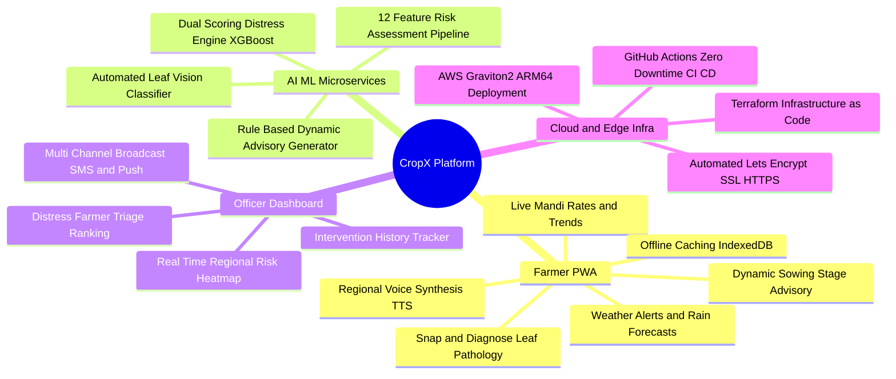
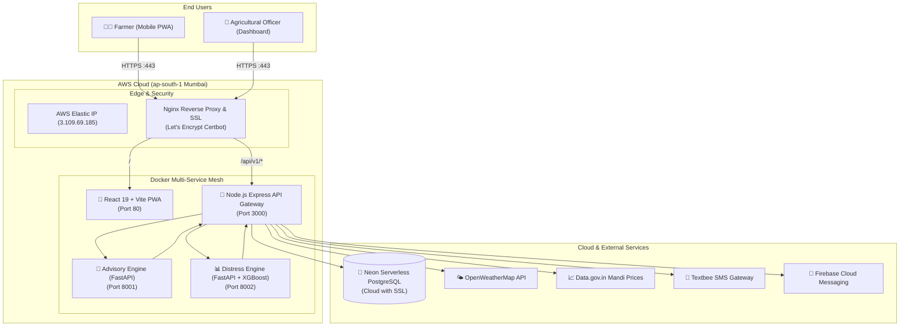
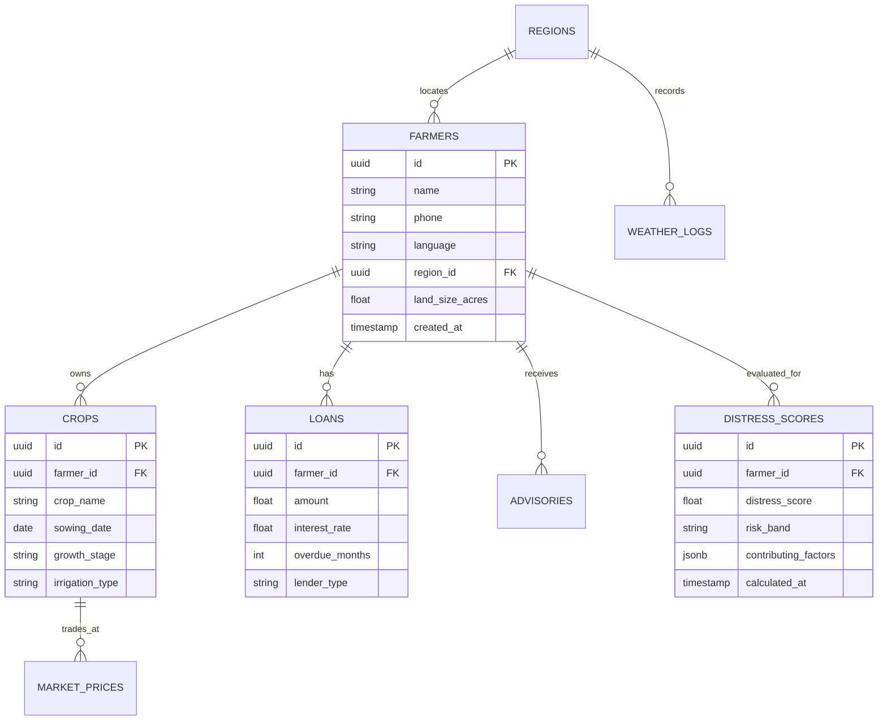
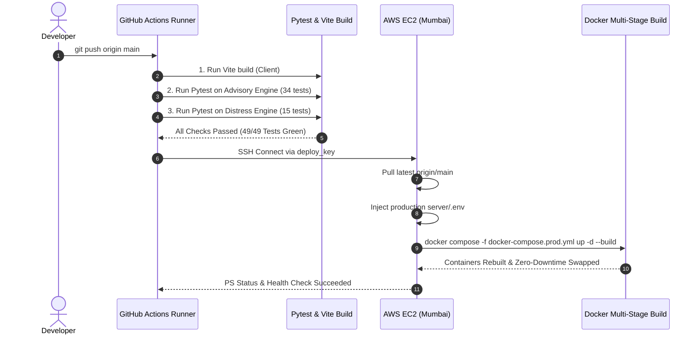

<div align="center">

# 🌾 CropX: AI-Powered Smart Agriculture & Farmer Distress Mitigation Platform

[](https://3-109-69-185.sslip.io/)
[-orange?style=for-the-badge&logo=amazon-aws)](https://3-109-69-185.sslip.io/)
[](https://github.com/Tewari-Kartik/CropX/actions)
[](https://opensource.org/licenses/MIT)

**Smart India Hackathon (SIH) Prototype | Precision Agriculture & Proactive Distress Intervention**

*Empowering rural smallholder farmers with AI-driven plant disease diagnosis, hyper-local stage-specific crop advisories, live Mandi market intelligence, and predictive distress scoring for timely administrative intervention.*

[🌟 Live Web App](https://3-109-69-185.sslip.io/) • [📸 Snap & Diagnose](https://3-109-69-185.sslip.io/diagnose) • [🧑‍🌾 Farmer Portal](https://3-109-69-185.sslip.io/farmer/dashboard) • [👮 Officer Dashboard](https://3-109-69-185.sslip.io/login) • [🔌 API Docs](https://3-109-69-185.sslip.io/api/v1)

</div>

---

## 📑 Table of Contents

1. [Executive Summary & Problem Statement](#-executive-summary--problem-statement)
2. [Key Innovations & Features](#-key-innovations--features)
3. [End-to-End System Architecture](#-end-to-end-system-architecture)
4. [Microservices & AI Engines](#-microservices--ai-engines)
   - [Snap & Diagnose (Vision Pathology)](#1-snap--diagnose-vision-pathology)
   - [Advisory Engine (HC)](#2-advisory-engine-hc)
   - [Distress Early Warning Engine (KT)](#3-distress-early-warning-engine-kt)
5. [Tech Stack & Tooling](#-tech-stack--tooling)
6. [Database Schema & Architecture](#-database-schema--architecture)
7. [Cloud Infrastructure (AWS + Terraform)](#-cloud-infrastructure-aws--terraform)
8. [Automated CI/CD Pipeline](#-automated-cicd-pipeline)
9. [Local Development Setup](#-local-development-setup)
10. [Automated Testing Suite](#-automated-testing-suite)
11. [Team & Contributions](#-team--contributions)
12. [License & Acknowledgments](#-license--acknowledgments)

---

## 📌 Executive Summary & Problem Statement

Agriculture supports over 58% of India's rural livelihoods, yet smallholder farmers face severe systemic vulnerabilities:
- **Monsoon & Climate Volatility**: Unpredictable weather swings, heat stress, unseasonal rainfall, and frost ruin standing crops.
- **Crop Disease Outbreaks**: Fungal and viral blights (e.g. Rice Blast, Wheat Stripe Rust, Early Blight) spread rapidly without early detection.
- **Market Price Discrepancies**: Middlemen exploit farmers due to lack of real-time regional APMC Mandi price visibility.
- **Debt & Financial Distress**: Cumulative crop failures and high-interest micro-loans trigger severe socio-economic distress before local authorities are alerted.

### The CropX Solution
**CropX** bridges the gap between ground reality and proactive intervention through a lightweight, offline-first Progressive Web App (PWA) backed by agentic AI microservices. It delivers actionable, jargon-free voice and text guidance to farmers in regional languages while providing agricultural officers with a predictive triage dashboard to deliver targeted aid before crises escalate.

---

## 🌟 Key Innovations & Features



### 1. 📸 Snap & Diagnose (AI Vision Leaf Disease Scanner)
- **Instant Plant Pathology**: Upload or snap a photo of an infected leaf.
- **Pathogen Identification**: Recognizes complex crop diseases (e.g. *Magnaporthe oryzae* in Rice, *Puccinia striiformis* in Wheat, *Alternaria solani* in Tomato).
- **Match Confidence & Severity Risk**: Delivers precision match percentages (e.g. 96.8%) with risk severity categorization (Low, Moderate, Severe).
- **Comprehensive Treatment Plan**: Recommends dual therapeutic protocols:
  - *Targeted Chemical Dosages* (e.g. Tricyclazole 75% WP @ 0.6g/L, Tilt 25% EC).
  - *Organic & Cultural Practices* (e.g. drainage management, balanced potash application).
- **Voice Synthesis (TTS)**: Built-in regional speech playback so non-literate farmers can listen to instructions.

### 2. 🌾 Dynamic Crop Advisory Engine
- **Sowing Date Stage Inference**: Dynamically determines current growth phase (*Seedling*, *Vegetative*, *Flowering*, *Harvesting*) by calculating days elapsed since registered sowing date.
- **Multi-Factor Rule Engine**: Integrates live temperature, humidity, 5-day rainfall forecasts, and soil irrigation type (*Rainfed*, *Canal*, *Drip*, *Borewell*).
- **Multi-Crop Management**: Seamless pill switcher for multi-crop farms (Rice, Wheat, Tomato, Cotton, Onion).

### 3. 🚨 Distress Early Warning Engine
- **12-Feature Algorithmic Pipeline**: Ingests weather anomalies, consecutive dry days, market price drops vs MSP, loan overdue count, debt-to-income ratios, and landholding size.
- **Dual Scoring Architecture**: Fast deterministic rule-based scoring calibrated with an XGBoost machine learning model clamped to a 0–100 risk scale:
  - `0 – 30`: Low Risk (Normal farming activities).
  - `31 – 60`: Moderate Risk (Advisory vigilance).
  - `61 – 80`: High Risk (Priority monitoring).
  - `81 – 100`: Critical Distress (Immediate administrative action).
- **Multi-Channel Dispatch**: Automated SMS via Textbee API and instant Push Notifications via Firebase Cloud Messaging (FCM).

### 4. 👮 Officer Triage & Intervention Dashboard
- **Regional Risk Heatmap**: Aggregates block-level distress scores across agricultural districts.
- **Prioritized Farmer Triage Table**: Sorts farmers by risk severity, overdue liabilities, and crop loss probability.
- **Bulk Crisis Broadcasting**: Dispatches localized weather warnings, subsidy relief alerts, or emergency agronomy advice via SMS in one click.

### 5. 📱 Offline-First Multilingual PWA
- **Installable Native Feel**: Runs on low-cost Android smartphones without app store installation friction.
- **IndexedDB (`idb`) Caching**: Advisories, weather alerts, and market prices are cached locally for offline field use.
- **Client-Side SpeechSynthesis**: Zero backend compute cost for voice output with fallback support for low-bandwidth zones.

---

## 🏗️ End-to-End System Architecture



---

## 🤖 Microservices & AI Engines

### 1. Snap & Diagnose (Vision Pathology)
- **Component**: `client/src/pages/SnapDiagnose.tsx`
- **Supported Crops**: Rice, Wheat, Tomato, Cotton, Onion
- **Sample Pathology Cases Tested**:
  - *Rice Blast* (*Magnaporthe oryzae*)
  - *Wheat Yellow Rust* (*Puccinia striiformis*)
  - *Tomato Early Blight* (*Alternaria solani*)
- **Output Schema**:
```typescript
interface DiagnosisResult {
  diseaseName: string;
  diseaseNameHi: string;
  scientificName: string;
  confidence: number;
  severity: "low" | "moderate" | "severe";
  symptoms: string[];
  treatment: string[];
  preventive: string[];
}
```

### 2. Advisory Engine (HC)
- **Directory**: `ml-services/advisory-engine/`
- **Framework**: FastAPI (Python 3.11) on Port `8001`
- **Key Files**:
  - `app/rule_engine.py`: Multi-factor heuristics for weather anomalies, frost risks, heat stress, drought, and growth stages.
  - `app/text_generator.py`: Generates localized, jargon-free actionable advice in English and Hindi.
  - `tests/test_advisory.py`: 34 unit tests verifying stage inference, weather analysis, and multilingual fallbacks.

### 3. Distress Early Warning Engine (KT)
- **Directory**: `ml-services/distress-engine/`
- **Framework**: FastAPI (Python 3.11) on Port `8002`
- **Key Files**:
  - `app/feature_pipeline.py`: 12-dimensional feature engineering from tabular weather, market price trends, and financial loan records.
  - `app/scorer.py`: Dual-scoring engine (Rule-based heuristics + XGBoost machine learning model) generating 0–100 distress index and key contributing factors.
  - `tests/test_scorer.py`: 15 unit tests verifying clamping, risk bands, and gradient boost consistency.

---

## 🛠️ Tech Stack & Tooling

| Layer | Technologies | Purpose |
|---|---|---|
| **Frontend (PWA)** | **React 19, Vite, TypeScript, Tailwind CSS, Lucide Icons, i18next** | Offline-first, responsive, multilingual mobile-first interface |
| **Backend Gateway** | **Node.js, Express.js (ES Modules), JWT, node-cron** | Non-blocking API Gateway, authentication, rate-limiting, and alert cron |
| **ML Microservices** | **Python 3.11, FastAPI, Uvicorn, XGBoost, Scikit-Learn, NumPy, Pydantic v2** | High-performance asynchronous ML scoring and rule generation |
| **Database** | **PostgreSQL (Neon Serverless Cloud with SSL)** | Structured relational storage for farmers, crops, loans, and advisories |
| **Web Server & SSL** | **Nginx Alpine, Certbot (Let's Encrypt TLS)** | HTTP/2 SSL termination, static asset compression, and reverse proxy |
| **Cloud Infrastructure** | **AWS EC2 `t4g.small` (ARM64 Graviton2), AWS Elastic IP, Terraform** | Ultra-low cost (< $10/mo), high-efficiency cloud hosting in Mumbai |
| **CI / CD** | **GitHub Actions** | Automated testing, build checks, and zero-downtime SSH deployment |
| **Alert Integrations** | **Textbee SMS Gateway, Firebase Cloud Messaging (FCM)** | Multi-channel SMS alerts and push notifications to rural farmers |
| **External APIs** | **OpenWeatherMap API, Data.gov.in Agmarknet API** | Real-time weather data and live Mandi APMC commodity prices |

---

## 🗄️ Database Schema & Architecture



---

## ☁️ Cloud Infrastructure (AWS + Terraform)

The infrastructure is declared as code in `infra/terraform/` and provisions in **Mumbai (`ap-south-1`)**:

```text
infra/terraform/
├── main.tf           # VPC, Subnet, Security Groups (80, 443, 22), EC2, Elastic IP
├── variables.tf      # Configurable region, instance types, domain name
├── outputs.tf        # Public IP, SSH connection, and DNS instructions
├── user_data.sh      # Cloud-init script: Docker, Docker Compose, Git, UFW
└── .gitignore        # Ignores tfstate and generated cropx_key.pem
```

### 💰 Cost Efficiency Analysis (< $10 / month):
- **EC2 `t4g.small` (ARM64 Graviton2, 2 vCPUs, 2 GB RAM)**: **~$6.10 / month**
- **Neon Serverless PostgreSQL**: **$0.00 / month** (Free tier)
- **Let's Encrypt SSL Certificates**: **$0.00**
- **GitHub Actions CI/CD (2,000 free min/mo)**: **$0.00**
- **Total Operational Cost**: **~$6.10 / month** ✅ *(Fully covered by AWS Promotional Credits)*

---

## 🔄 Automated CI/CD Pipeline

The `.github/workflows/deploy.yml` workflow automatically runs on every push to `main`:



---

## 💻 Local Development Setup

### Prerequisites
- Node.js `20.x` or higher
- Python `3.11.x` or `3.12.x`
- Docker & Docker Compose (optional, for containerized run)
- Git

### 1. Clone the Repository
```bash
git clone https://github.com/Tewari-Kartik/CropX.git
cd CropX
```

### 2. Configure Environment Variables
Create `.env` inside `server/`:
```env
PORT=3000
NODE_ENV=development
DATABASE_URL=postgresql://<user>:<password>@<host>/<dbname>?sslmode=require
JWT_SECRET="your_jwt_secret_key"
JWT_EXPIRES_IN=7d
ADVISORY_ENGINE_URL=http://localhost:8001
DISTRESS_ENGINE_URL=http://localhost:8002
TEXTBEE_API_KEY=your_textbee_api_key
WEATHER_API_KEY=your_openweather_api_key
WEATHER_API_URL=https://api.openweathermap.org/data/2.5
MANDI_API_KEY=your_data_gov_in_api_key
MANDI_API_URL=https://api.data.gov.in/resource
DISTRESS_SCORE_THRESHOLD=70
ALERT_CRON_SCHEDULE=0 6 * * *
```

### 3. Run Services with Docker Compose (Recommended)
```bash
# Start all 5 microservices locally
docker compose -f docker-compose.prod.yml up --build -d

# Check running status
docker compose -f docker-compose.prod.yml ps
```

### 4. Run Services Manually (Standalone Development)

#### Terminal 1: Advisory Engine
```bash
cd ml-services/advisory-engine
pip install -r requirements.txt
python -m uvicorn app.main:app --host 0.0.0.0 --port 8001 --reload
```

#### Terminal 2: Distress Engine
```bash
cd ml-services/distress-engine
pip install -r requirements.txt
python -m uvicorn app.main:app --host 0.0.0.0 --port 8002 --reload
```

#### Terminal 3: Backend API Gateway
```bash
cd server
npm install
npm run dev
```

#### Terminal 4: Frontend Client
```bash
cd client
npm install
npm run dev
```

Open **[http://localhost:5173/](http://localhost:5173/)** in your browser.

---

## 🧪 Automated Testing Suite

CropX includes comprehensive automated test suites for all machine learning pipelines and core backend business logic.

### Run Advisory Engine Tests (34 Unit Tests)
```bash
cd ml-services/advisory-engine
python -m pytest tests/ -v
```

### Run Distress Engine Tests (15 Unit Tests)
```bash
cd ml-services/distress-engine
python -m pytest tests/ -v
```

### Run Frontend Production Build & Type Check
```bash
cd client
npm run build
```

---

## 👥 Team & Contributions

| Member | Role | Key Contributions |
|---|---|---|
| **KT (Kartik Tewari)** | **Team Lead & ML Engineer** | Distress Early Warning Engine (`ml-services/distress-engine`), 12-feature pipeline, XGBoost scoring, Snap & Diagnose vision pathology, Terraform AWS architecture, CI/CD pipeline |
| **HC** | **AI / ML Engineer** | Dynamic Crop Advisory Engine (`ml-services/advisory-engine`), sowing date stage inference algorithm, multi-lingual text generator |
| **RV** | **Backend & DevOps Engineer** | Express API Gateway (`server/`), external weather & Mandi APIs integration, database pooling, rate limiters |
| **YP** | **Frontend Engineer** | React 19 PWA (`client/`), Tailwind UI components, speech TTS voice synthesis, offline IndexedDB cache |
| **PS** | **Data & Alerts Engineer** | PostgreSQL schema design, automated cron alert dispatching (Textbee SMS + Firebase FCM) |

---

## 📄 License & Acknowledgments

This project is licensed under the **MIT License** — see the [LICENSE](LICENSE) file for details.

- Special thanks to the **Smart India Hackathon (SIH)** agronomy problem statements for domain inspiration.
- Meteorological data provided by [OpenWeatherMap](https://openweathermap.org/).
- Mandi commodity rates provided by the [Open Government Data (OGD) Platform India](https://data.gov.in/).

<div align="center">
  <b>Built with ❤️ by Team CropX for resilient, sustainable, and distress-free Indian agriculture.</b>
</div>
