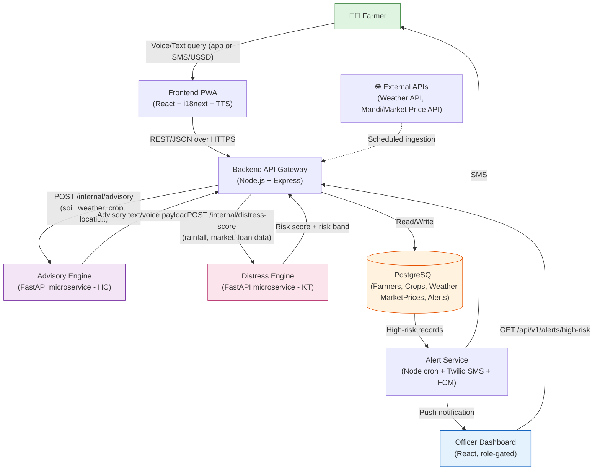
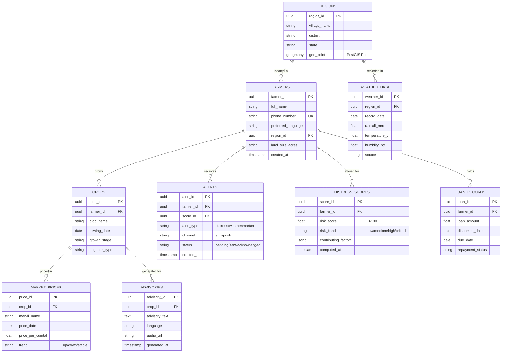
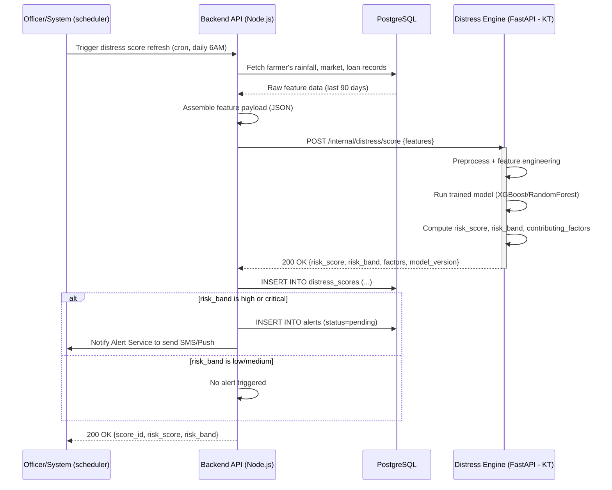

# architecture.md

## 1. Recommended Tech Stack

| Layer | Choice | Owner | Why |
|---|---|---|---|
| Frontend | **React + Vite (PWA)**, Tailwind CSS, `i18next` for multilingual, IndexedDB (via `idb`) for offline cache | YP | PWA gives offline-first + installable app on cheap Android phones without native build overhead. `i18next` handles multilingual text; TTS for voice output uses the browser `SpeechSynthesis` API (zero backend cost) with a fallback to a pre-recorded audio clip cache for low-bandwidth areas. |
| Backend (API Gateway) | **Node.js + Express (TypeScript)** | RV | Fast to scaffold in a hackathon, huge middleware ecosystem (auth, rate-limit, compression), non-blocking I/O suits many concurrent low-payload requests from rural users. Talks to ML services over internal HTTP. |
| Database | **PostgreSQL** (hosted on Supabase or Railway for instant provisioning) | PS | Structured, relational data (farmers, crops, weather, prices, alerts) with strong needs for joins, foreign keys, and geospatial queries (`PostGIS` extension for village/district lookups). Supabase also gives free auth + realtime out of the box, saving hackathon time. |
| AI/ML Services | **Python + FastAPI**, two separate microservices: `advisory-engine` and `distress-engine`, using `scikit-learn` / `XGBoost` for scoring and a rule-engine + optional LLM call (via API) for advisory text generation | HC (Advisory), KT (Distress) | FastAPI is async, auto-generates OpenAPI docs (useful for RV to integrate fast without back-and-forth), and Python is the natural choice for the ML stack the team already knows. Keeping them as **two separate services** lets HC and KT work in parallel without blocking each other or RV. |
| Messaging/Alerts | **Node cron job + Twilio (SMS) / Firebase Cloud Messaging (push)** | PS | SMS is the most reliable low-bandwidth channel for farmers; FCM push for the Officer Dashboard web app. |
| Deployment | **Frontend:** Vercel/Netlify. **Backend + ML services:** Docker containers on Railway/Render (or a single droplet with `docker-compose` if judges want a live demo without cloud dependency). **DB:** Supabase managed Postgres. | RV (infra), all (containers) | One-click deploys, free tiers cover a hackathon demo, and `docker-compose.yml` lets the whole stack run locally as a fallback if WiFi at the venue fails. |

**How they connect:**
Frontend (PWA) → calls Backend REST API over HTTPS/JSON → Backend calls the two Python ML microservices internally over HTTP (Docker network) → Backend persists everything in Postgres → Backend triggers Alert Service (cron + Twilio/FCM) → Officer Dashboard (same React app, role-gated) polls/reads alerts from Backend.

---

## 2. System Architecture



**Step-by-step data flow:**
1. **Farmer** interacts via the PWA (or a low-bandwidth SMS/USSD gateway) in their local language, either typing/speaking a query or simply opening the app to check today's advisory.
2. **Frontend** sends a lightweight JSON request to the **Backend API**, caching the last successful response locally (IndexedDB) so the app still shows something if offline.
3. **Backend API** authenticates the farmer, fetches their profile/crop/location context from **PostgreSQL**, and calls the **Advisory Engine** (weather + soil + market + crop → text/voice advice) and, on a schedule or on-demand, the **Distress Engine** (rainfall history + market volatility + loan/repayment data → risk score).
4. Both ML microservices return structured JSON (advisory text + confidence, or risk score + band) back to the Backend.
5. **Backend** persists the advisory/risk result in **PostgreSQL** and returns the advisory to the Frontend for immediate display/voice playback.
6. A scheduled job in the **Alert Service** scans the DB for farmers whose distress score crosses a threshold, sends them an **SMS** (low-bandwidth safe) and pushes a notification to the **Officer Dashboard**.
7. **Officers** log into the Dashboard, call `GET /api/v1/alerts/high-risk` to see prioritized farmer risk lists per region, and can drill into individual farmer history for intervention planning.
8. External data (weather, mandi prices) is ingested on a schedule into the Backend, which normalizes and stores it for both engines to consume — decoupling live external API latency from the farmer-facing request path.

---

## 3. Database Design (RV)

**Choice: PostgreSQL** — relational integrity across Farmers/Crops/Alerts is important, `PostGIS` supports village/district geo-queries, and it plays well with both Supabase (fast hackathon setup) and standard ORMs (Prisma/Sequelize) on the Node backend.



**Primary / Foreign Keys & Vital Indexes:**

| Table | PK | FK | Indexes (why) |
|---|---|---|---|
| `farmers` | `farmer_id` | `region_id → regions` | Unique index on `phone_number` (login/SMS lookup); btree on `region_id` (officer dashboard filters by area) |
| `regions` | `region_id` | — | GIST index on `geo_point` (PostGIS proximity queries for nearest weather station) |
| `crops` | `crop_id` | `farmer_id → farmers` | Index on `(farmer_id, growth_stage)` (fast lookup when generating advisory) |
| `weather_data` | `weather_id` | `region_id → regions` | Composite index on `(region_id, record_date DESC)` (latest weather fetch is the hottest query) |
| `market_prices` | `price_id` | `crop_id → crops` | Composite index on `(crop_id, price_date DESC)` (trend calculation, most recent price) |
| `loan_records` | `loan_id` | `farmer_id → farmers` | Index on `repayment_status` (distress engine batch scans overdue loans) |
| `distress_scores` | `score_id` | `farmer_id → farmers` | Index on `(risk_band, computed_at DESC)` (officer dashboard "current high-risk list" query) |
| `advisories` | `advisory_id` | `crop_id → crops` | Index on `generated_at` (cache invalidation / "today's advisory" lookup) |
| `alerts` | `alert_id` | `farmer_id → farmers`, `score_id → distress_scores` | Index on `(status, created_at)` (Alert Service polls pending alerts) |

---

## 4. Backend API Contracts (RV)

Base path: `/api/v1`. All responses wrapped as `{ "success": bool, "data": {...}, "error": null | string }`.

### 4.1 Create Farmer Profile
`POST /api/v1/farmers`

**Purpose:** Register a new farmer with basic profile, location, and crop info during onboarding.

Request:
```json
{
  "full_name": "Ramesh Kumar",
  "phone_number": "+919876543210",
  "preferred_language": "hi",
  "region": {
    "village_name": "Barrackpore",
    "district": "North 24 Parganas",
    "state": "West Bengal"
  },
  "land_size_acres": 2.5,
  "crops": [
    { "crop_name": "Rice", "sowing_date": "2026-06-15", "irrigation_type": "rainfed" }
  ]
}
```

Response `201`:
```json
{
  "success": true,
  "data": {
    "farmer_id": "f8b2...c91",
    "full_name": "Ramesh Kumar",
    "region_id": "r1a4...e02",
    "created_at": "2026-08-28T10:15:00Z"
  },
  "error": null
}
```

### 4.2 Get Personalized Advisory
`GET /api/v1/farmers/{farmer_id}/advisory?crop_id={crop_id}&lang={lang}`

**Purpose:** Fetch (or trigger generation of) today's crop advisory in the farmer's language, text + optional audio URL.

Response `200`:
```json
{
  "success": true,
  "data": {
    "advisory_id": "a771...d3f",
    "crop_name": "Rice",
    "advisory_text": "Delay irrigation by 2 days due to expected rainfall on Thursday.",
    "language": "hi",
    "audio_url": "https://cdn.example.com/audio/a771.mp3",
    "generated_at": "2026-08-28T06:00:00Z",
    "sources": ["weather_data", "growth_stage"]
  },
  "error": null
}
```

### 4.3 Calculate / Get Distress Risk
`POST /api/v1/farmers/{farmer_id}/distress-score`

**Purpose:** Trigger (or refresh) the distress risk calculation for a farmer using latest rainfall, market, and loan data; returns score + contributing factors.

Request:
```json
{
  "force_recompute": false
}
```

Response `200`:
```json
{
  "success": true,
  "data": {
    "score_id": "s902...771",
    "farmer_id": "f8b2...c91",
    "risk_score": 78.4,
    "risk_band": "high",
    "contributing_factors": {
      "rainfall_deficit_pct": 42,
      "market_price_drop_pct": 18,
      "loan_overdue_days": 35
    },
    "computed_at": "2026-08-28T09:00:00Z"
  },
  "error": null
}
```

`GET /api/v1/farmers/{farmer_id}/distress-score` — returns the latest cached score without recomputation, same response shape.

### 4.4 Get High-Risk Alerts (Officers)
`GET /api/v1/alerts/high-risk?region_id={region_id}&min_band=high&status=pending&page=1&limit=20`

**Purpose:** List farmers currently flagged as high/critical risk within an officer's jurisdiction, for triage and field visits.

Response `200`:
```json
{
  "success": true,
  "data": {
    "total": 47,
    "page": 1,
    "limit": 20,
    "alerts": [
      {
        "alert_id": "al33...901",
        "farmer_id": "f8b2...c91",
        "farmer_name": "Ramesh Kumar",
        "phone_number": "+919876543210",
        "village_name": "Barrackpore",
        "risk_score": 78.4,
        "risk_band": "high",
        "alert_type": "distress",
        "status": "pending",
        "created_at": "2026-08-28T09:05:00Z"
      }
    ]
  },
  "error": null
}
```

---

## 5. AI/ML Integration Architecture (HC & KT)

**Pattern:** Both ML modules are deployed as **independent FastAPI microservices**, each in its own Docker container, exposed only on the internal Docker network (not publicly). The Node.js Backend is the sole caller — it treats them as internal REST dependencies, never exposing their endpoints directly to the Frontend. This choice (over inline scripts or serverless functions) was made because:
- HC and KT can iterate/retrain models independently without touching RV's codebase.
- FastAPI auto-generates OpenAPI/Swagger docs, so RV can integrate against a contract immediately, even with stub responses, before the real models are ready.
- Containerized services are trivially deployable alongside the backend via `docker-compose` for the live demo, with clean horizontal separation if one service needs to scale or be swapped later (e.g., distress model retrained with new data mid-hackathon).

**Internal service contracts (not public-facing):**
- `POST /internal/advisory/generate` — Advisory Engine (HC): input = weather/soil/crop/location JSON → output = advisory text + language + audio flag.
- `POST /internal/distress/score` — Distress Engine (KT): input = rainfall/market/loan JSON → output = risk score, band, contributing factors (SHAP-style feature importances if time permits).

Both services share a `MODEL_VERSION` field in every response so RV can log which model produced which score in Postgres (`distress_scores.contributing_factors` jsonb) — useful for the hackathon demo narrative ("explainable AI").

### Sequence Diagram — Distress Risk Scorer Inference Flow


